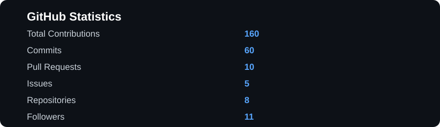
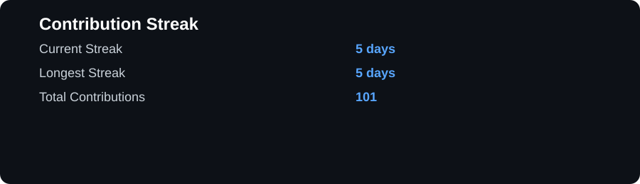
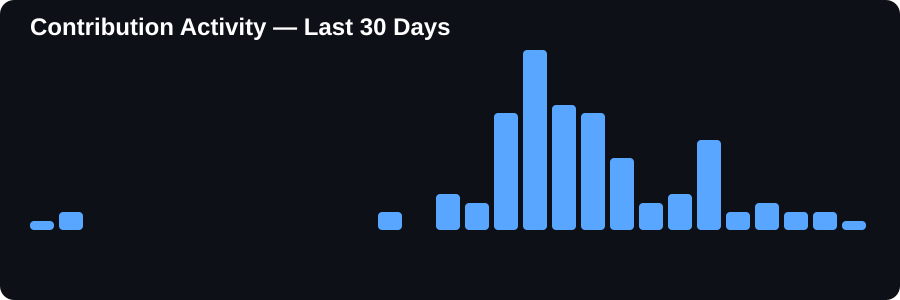

  

  <b>Software Engineering • QA • Testing • Automation</b>

---

## 👋 About Me

I'm an **Information Technology student** interested in building reliable software and understanding how systems work across development, testing, automation, and deployment.

My primary focus is **Quality Assurance and Test Automation**, with hands-on experience and continuous learning across **Java, Python, Selenium WebDriver, TestNG, API testing, Git/GitHub, Linux, and DevOps**.

Alongside testing, I enjoy building practical software projects, experimenting with automation, exploring cybersecurity, and contributing to open-source projects.

> **I don't just want to build software that works — I want to build software that can be trusted.**

---

## 🧑‍💻 What I Do

- 🧪 **QA & Test Automation** — designing reliable automated testing workflows
- 🤖 **Browser Automation** — Selenium WebDriver, Java & TestNG
- 🌐 **API Testing** — REST APIs, functional testing & validation
- 🐍 **Python Development** — automation, tooling & experimentation
- ⚙️ **DevOps & CI/CD** — learning modern software delivery practices
- 🐧 **Linux** — development, automation & system fundamentals
- 🔐 **Cybersecurity** — exploring secure software development
- 🌐 **Web Development** — building practical software projects
- 🤝 **Open Source** — issues, testing, documentation, pull requests & bug fixes

---

## 🛠️ Tech Stack

### 💻 Languages

### 🖥️ Frameworks & UI

### 🧪 Testing & Automation

### ⚙️ Tools & Platforms

### 🚀 Currently Exploring

`CI/CD` • `DevOps` • `Cybersecurity` • `API Automation` • `Open Source` • `Software Architecture`

---

## 🚀 What I'm Working On

### 🧪 Test Automation

Building automated testing workflows using:

- Selenium WebDriver
- Java
- TestNG
- Page Object Model
- Functional & regression testing
- API testing
- Test reporting

### 🛠️ Software Projects

Building practical software projects that combine:

- Automation
- Web technologies
- Developer tooling
- Software engineering
- Testing

I prefer projects that solve **real problems** rather than simply demonstrating a technology.

### 🌐 Open Source

Continuously improving my open-source workflow through:

- Issues
- Pull requests
- Documentation
- Testing
- Bug fixes
- Developer tooling

---

## 📌 Featured Projects

### 🔍 Social Media Account Hygiene Automation

An automation-focused project designed to help manage and maintain social-media account activity through automated workflows.

**Focus:** Python • Automation • Browser Automation • Software Engineering

### 🌐 Personal Portfolio

A modern developer portfolio designed to showcase projects, technical skills and engineering work.

**Focus:** TypeScript • React • Web Development • UI/UX

### 🧪 QA & Automation Projects

A collection of testing experiments and automation projects covering browser automation, functional testing and API testing.

**Focus:** Java • Selenium • TestNG • API Testing

---

## 📊 GitHub Statistics

  

  

---

## 📈 Contribution Activity

  

  

---

## 🤝 Let's Connect

---

## 💭 Engineering Philosophy

> **Learn → Build → Test → Break → Fix → Improve**

I believe the best way to learn software engineering is to build real things, intentionally break them, understand why they failed, and make them better.

---

  <b>Thanks for visiting my profile! 🚀</b>

